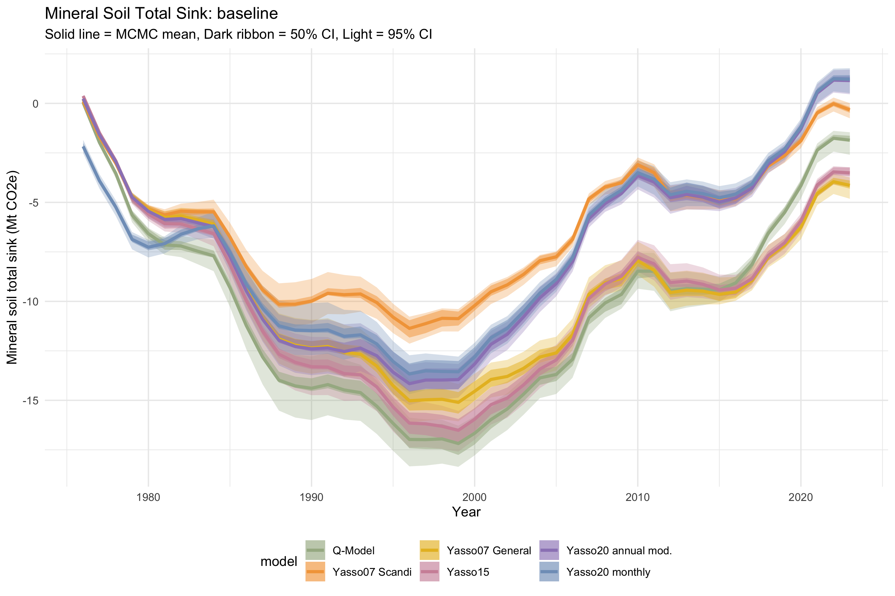

exclude: true

```{r setup, include=FALSE}
knitr::opts_chunk$set(echo = FALSE, warning = FALSE, message = FALSE,
                      fig.retina = 3, fig.align = "center")
library(ggplot2)
library(dplyr)
library(tidyr)
```

```{css, echo=FALSE}
/* Custom styles */
.remark-slide-content {
  font-size: 20px;
  padding: 1em 2em;
}
.remark-slide-content h1 {
  font-size: 1.8em;
  color: #2d6a4f;
}
.remark-slide-content h2 {
  font-size: 1.4em;
  color: #2d6a4f;
  border-bottom: 2px solid #2d6a4f;
  padding-bottom: 4px;
}
.highlight-box {
  background: #d8f3dc;
  border-left: 5px solid #2d6a4f;
  padding: 12px 18px;
  border-radius: 4px;
  margin: 10px 0;
}
.warning-box {
  background: #fff3cd;
  border-left: 5px solid #e6a817;
  padding: 12px 18px;
  border-radius: 4px;
  margin: 10px 0;
}
.key-number {
  font-size: 2.2em;
  font-weight: bold;
  color: #2d6a4f;
  display: block;
  text-align: center;
}
.columns-2 {
  display: grid;
  grid-template-columns: 1fr 1fr;
  gap: 2em;
  align-items: start;
}
.columns-3 {
  display: grid;
  grid-template-columns: 1fr 1fr 1fr;
  gap: 1.5em;
  align-items: start;
}
.model-card {
  background: #f8f9fa;
  border: 1px solid #dee2e6;
  border-radius: 6px;
  padding: 10px 14px;
  font-size: 0.88em;
}
.model-card h3 {
  color: #2d6a4f;
  margin: 0 0 6px 0;
  font-size: 1em;
}
.footnote {
  font-size: 0.75em;
  color: #888;
}
.inverse h1, .inverse h2 { color: white; border-color: rgba(255,255,255,0.4); }

/* Title slide override */
.title-slide {
  background-color: #1b4332 !important;
  color: white !important;
}
.title-slide h1, .title-slide h2, .title-slide h3,
.title-slide .author, .title-slide .date, .title-slide .subtitle {
  color: white !important;
  text-shadow: none !important;
}
.title-slide h1 { font-size: 2em; border-bottom: 2px solid rgba(255,255,255,0.4); padding-bottom: 0.3em; }
.title-slide h2 { font-size: 1.2em; font-weight: 400; border: none; }
.title-slide .author { margin-top: 1.5em; font-size: 1em; opacity: 0.9; }
.title-slide .date { font-size: 0.85em; opacity: 0.7; }
```

---
class: inverse, center, middle

# Setting the Scene

---

## Why Finland? Why Now?

Finland is **74% forested** and must report its forest carbon balance annually as part of its climate commitments.
But recent model projections are raising an alarm:

.columns-2[

.highlight-box[
**Finnish forest soils appear to be approaching carbon sink saturation** — absorbing less and less CO₂ each decade, and potentially becoming a net *source* in the near future.
]

<br>

This is currently **model-based** — and different models tell different stories about *when* and *how fast* this happens.

<br>

Before this finding can inform national policy, we need to ask:

> *Is sink saturation real physics — or a modelling artefact?*

That is exactly what this project sets out to answer.
</div>
]

---
class: inverse, center, middle

# Part 1
## How Do We Model Soil Carbon?

---

## The Basic Idea: First-Order Kinetics

Soil organic carbon (SOC) models all share one foundational assumption: carbon pools decay at a **rate proportional to their size**. Think of it like radioactive decay, or how a population of bacteria might decline while exhausting their substrate (which is exactly the case).

$$\frac{dC}{dt} = \text{Inputs} - k \cdot C$$

<h3>C — Carbon pool</h3>
How much carbon is currently stored in a particular type of organic matter

<h3>k — Decomposition rate</h3>
How fast that material breaks down — different for leaves, roots, woody debris...

<h3>Inputs</h3>
Fresh litter arriving from tree roots, fallen leaves, dead branches


<br>

---

## Multi-Pool Models: Matrix Notation

A model with $n$ pools can be written compactly as:

$$\frac{d\mathbf{C}}{dt} = \xi(T, W) \cdot \mathbf{A} \cdot \mathbf{K} \cdot \mathbf{C}(t) + \mathbf{I}(t)$$

.columns-3[
<div class="model-card">
<h3><b>K</b> — rate matrix</h3>
Diagonal matrix of pool-specific decomposition rates \(k_i\)
</div>
<div class="model-card">
<h3><b>A</b> — transfer matrix</h3>
Controls how carbon flows from one pool to the next. Diagonal = total \(k_j C_j\) outflow from each pool (-1); off-diagonal = transfer fractions between pools. 
</div>
<div class="model-card">
<h3>\(\xi(T,W)\), climate/edaphic modifier</h3>
Scalar, rescales all rates simultaneously as a function of temperature and moisture
</div>
]


---

## Multi-Pool Models: Explicit 3-Pool Cascade

An example with three pools in a **cascade** (no back-transfers), the system expands to:

$$\frac{d}{dt}\begin{pmatrix} C_1 \\ C_2 \\ C_3 \end{pmatrix} = \xi(T,W) \cdot \underbrace{\begin{pmatrix} -1 & 0 & 0 \\ a_{21} & -1 & 0 \\ 0 & a_{32} & -1 \end{pmatrix}}_{\mathbf{A}} \cdot \underbrace{\begin{pmatrix} k_1 & 0 & 0 \\ 0 & k_2 & 0 \\ 0 & 0 & k_3 \end{pmatrix}}_{\mathbf{K}} \cdot \begin{pmatrix} C_1 \\ C_2 \\ C_3 \end{pmatrix} + \begin{pmatrix} I_1 \\ 0 \\ 0 \end{pmatrix}$$

<div style="display: grid; grid-template-columns: 1fr 1fr 0.6fr; gap: 1.5em; align-items: start; margin-top: 0.8em;">


<div>
<b>At steady state</b> \(\left(\frac{d\mathbf{C}}{dt} = 0\right)\):
\[\mathbf{C}^* = -\xi \cdot (\mathbf{A}\mathbf{K})^{-1} \cdot \mathbf{I}\]
This is how we <b>initialise</b> all models — solving analytically for equilibrium carbon stocks, avoiding costly 1000-year spin-ups.
</div>

<div style="text-align: center;">
<svg width="260" height="300" viewBox="0 0 220 260" font-family="sans-serif" font-size="12">

  <!-- Inputs arrow -->
  <text x="110" y="18" text-anchor="middle" fill="#555" font-size="11">Inputs $I_1$</text>
  <line x1="110" y1="22" x2="110" y2="44" stroke="#555" stroke-width="1.5" marker-end="url(#arr)"/>

  <!-- Pool 1 -->
  <rect x="60" y="45" width="100" height="40" rx="6" fill="#d8f3dc" stroke="#2d6a4f" stroke-width="1.5"/>
  <text x="110" y="61" text-anchor="middle" fill="#1b4332" font-weight="bold">Pool 1</text>
  <text x="110" y="76" text-anchor="middle" fill="#1b4332" font-size="10">Fast — $k_1$</text>

  <!-- CO2 loss 1 -->
  <line x1="160" y1="65" x2="200" y2="65" stroke="#e76f51" stroke-width="1.5" marker-end="url(#arrRed)" stroke-dasharray="4,2"/>
  <text x="202" y="69" fill="#e76f51" font-size="10">CO₂</text>

  <!-- Transfer 1→2 -->
  <line x1="110" y1="85" x2="110" y2="114" stroke="#2d6a4f" stroke-width="1.5" marker-end="url(#arrGreen)"/>
  <text x="116" y="103" fill="#2d6a4f" font-size="10">$a_{21}$</text>

  <!-- Pool 2 -->
  <rect x="60" y="115" width="100" height="40" rx="6" fill="#b7e4c7" stroke="#2d6a4f" stroke-width="1.5"/>
  <text x="110" y="131" text-anchor="middle" fill="#1b4332" font-weight="bold">Pool 2</text>
  <text x="110" y="146" text-anchor="middle" fill="#1b4332" font-size="10">Medium — $k_2$</text>

  <!-- CO2 loss 2 -->
  <line x1="160" y1="135" x2="200" y2="135" stroke="#e76f51" stroke-width="1.5" marker-end="url(#arrRed)" stroke-dasharray="4,2"/>
  <text x="202" y="139" fill="#e76f51" font-size="10">CO₂</text>

  <!-- Transfer 2→3 -->
  <line x1="110" y1="155" x2="110" y2="184" stroke="#2d6a4f" stroke-width="1.5" marker-end="url(#arrGreen)"/>
  <text x="116" y="173" fill="#2d6a4f" font-size="10">$a_{32}$</text>

  <!-- Pool 3 -->
  <rect x="60" y="185" width="100" height="40" rx="6" fill="#74c69d" stroke="#2d6a4f" stroke-width="1.5"/>
  <text x="110" y="201" text-anchor="middle" fill="#1b4332" font-weight="bold">Pool 3</text>
  <text x="110" y="216" text-anchor="middle" fill="#1b4332" font-size="10">Slow — $k_3$</text>

  <!-- CO2 loss 3 -->
  <line x1="160" y1="205" x2="200" y2="205" stroke="#e76f51" stroke-width="1.5" marker-end="url(#arrRed)" stroke-dasharray="4,2"/>
  <text x="202" y="209" fill="#e76f51" font-size="10">CO₂</text>

  <defs>
    <marker id="arr" markerWidth="6" markerHeight="6" refX="5" refY="3" orient="auto">
      <path d="M0,0 L0,6 L6,3 z" fill="#555"/>
    </marker>
    <marker id="arrGreen" markerWidth="6" markerHeight="6" refX="5" refY="3" orient="auto">
      <path d="M0,0 L0,6 L6,3 z" fill="#2d6a4f"/>
    </marker>
    <marker id="arrRed" markerWidth="6" markerHeight="6" refX="5" refY="3" orient="auto">
      <path d="M0,0 L0,6 L6,3 z" fill="#e76f51"/>
    </marker>
  </defs>

</svg>
</div>

</div>

---

## What Defines a SOC Model?

All models share the first-order kinetics framework, but they differ in **how they organise carbon into pools**. The fundamental question is :*"What makes one piece of organic matter decompose faster than another?"*

.columns-2[
<div>
.highlight-box[
The general theory is that carbon exists on a **quality spectrum**, which last centuries paradigms of humus fractionation interpreted as purely chemical: some compounds are easier for microbes to break down (sugars, starch) while others are more resistant (lignin, waxes). 
It is being recently questioned by a novel interpretation, seeing carbon quality as an emergent ecosystem property. First order models still work, though, just their interpretation is changing!
]
</div>
]

Some examples:

| Approach | Philosophy | Example |
|----------|-----------|---------|
| **Chemical fractionation** | Decomposability is determined by molecular structure (sugars vs. lignin) | Yasso models |
| **Fixed functional pools** | Carbon sorted into pools by turnover time (fast/slow/resistant) | RothC |
| **Decomposability continuum** | Carbon exists on a continuous quality spectrum — no sharp categories | Q-model |

---

## A Key Insight: Discrete vs. Continuous Pools

```{r pool-concept, fig.height=4, fig.width=11}
set.seed(42)
n <- 1000
x <- seq(0, 1, length.out = 300)

# Continuous quality distribution
continuous_density <- dgamma(x * 10, shape = 1.5, rate = 1) 
continuous_density <- continuous_density / max(continuous_density)

# Discrete pools — approximation
pool_positions <- c(0.08, 0.35, 0.75)
pool_heights <- c(0.95, 0.75, 0.45)
pool_widths <- c(0.07, 0.08, 0.1)

df_cont <- data.frame(x = x, y = continuous_density)

p1 <- ggplot() +
  geom_area(data = df_cont, aes(x = x, y = y), fill = "#2d6a4f", alpha = 0.6) +
  annotate("text", x = 0.05, y = 1.05, label = "Fast", colour = "#1b4332", size = 4, fontface = "bold") +
  annotate("text", x = 0.5,  y = 0.5,  label = "Intermediate", colour = "#1b4332", size = 4, fontface = "bold") +
  annotate("text", x = 0.85, y = 0.25, label = "Slow", colour = "#1b4332", size = 4, fontface = "bold") +
  labs(title = "Continuous quality (Q-model)",
       x = "Carbon quality (low = fast decomposing)",
       y = "Amount of carbon") +
  theme_minimal(base_size = 13) +
  theme(axis.text.y = element_blank(), axis.ticks.y = element_blank())

# Discrete pools
pool_df <- data.frame(
  Pool = factor(c("Extractives\n(AWEN: A+W)", "Cellulose\n(N)", "Lignin\n(E)"),
                levels = c("Extractives\n(AWEN: A+W)", "Cellulose\n(N)", "Lignin\n(E)")),
  Amount = c(0.95, 0.65, 0.35),
  Rate = c("Fast\n(years)", "Medium\n(decades)", "Slow\n(centuries)")
)

p2 <- ggplot(pool_df, aes(x = Pool, y = Amount, fill = Pool)) +
  geom_col(width = 0.5, show.legend = FALSE) +
  scale_fill_manual(values = c("#52b788", "#2d6a4f", "#1b4332")) +
  labs(title = "Discrete chemical pools (Yasso)",
       x = NULL, y = "Amount of carbon") +
  theme_minimal(base_size = 13) +
  theme(axis.text.y = element_blank(), axis.ticks.y = element_blank())

gridExtra::grid.arrange(p2, p1, ncol = 2)
```

.footnote[Both approaches use first-order kinetics and are almost equivalent in the shape they describe, the main difference is in **how many pools**, which means how much approximation. **On a decades to century time scale, this just does not matter**]

---

## Temperature and Moisture Change Everything

The decomposition rate $k$ is not fixed — it responds to the environment.

.columns-2[
<div>
<b>Temperature sensitivity</b>

Warmer soils decompose organic matter faster.
Different models express this relationship differently (Arrhenius functions, Q10 factors, Gaussian curves) — and this turns out to <b>matter a lot</b> for long-term projections.
</div>

```{r temp-response, fig.height=4, fig.width=5}
temp <- seq(-10, 30, 0.1)

# Three different temperature response functions
q10_response <- exp(log(1.522536) * temp / 10)        # Q10 = 2
arrhenius <- exp(0.065 * (temp - 10))           # Arrhenius-like
gaussian   <- exp(-0.5 * ((temp - 30) / 18)^2) * 2.5 # Gaussian (Yasso)
gaussian <- gaussian / gaussian[which.min(abs(temp - 10))]

df_temp <- data.frame(
  Temperature = rep(temp, 3),
  Response = c(q10_response, arrhenius, gaussian),
  Model = rep(c("Q10 factor", "Arrhenius", "Gaussian (Yasso)"), each = length(temp))
)

ggplot(df_temp, aes(x = Temperature, y = Response, colour = Model, linetype = Model)) +
  geom_line(size = 1.1) +
  scale_colour_manual(values = c("#e76f51", "#2d6a4f", "#457b9d")) +
  scale_linetype_manual(values = c("solid", "dashed", "dotdash")) +
  labs(x = "Temperature (°C)", y = "Decomposition rate\n(relative to 10°C)",
       colour = NULL, linetype = NULL) +
  theme_minimal(base_size = 13) +
  theme(legend.position = "bottom")
```
]


---

## But also the rate of change of the rate of change might not be constant

The decomposition rate $k$ is not fixed and scales with temperature according to a function, with a certain slope (temperature sensitivity).

But <b>different organic materials respond differently to temperature changes</b>. Thermodynamic theory predicts the more stable the material, the more it responds to temperature.

Organic matter is a chemical blob of many molecules, and since the composition of this blob changes with decomposition, also <b>its temperature sensitivity is likely changing while decomposition proceeds</b>. Yasso15 and 20 represents this with different temperature response functions by pool, but there are also other approaches.


---
class: inverse, center, middle

# Part 2
## The Problem We're Trying to Solve

---

## The HIKET Challenge

Finland's greenhouse gas inventory relies on **soil carbon models** to project how forests will behave under climate change. Different models give different answers.

<div style="display: grid; grid-template-columns: 1fr 1fr; gap: 2em; align-items: center;">

<div>

</div>

<div>
.warning-box[
**The problem:**

Each model was originally calibrated against different datasets, in different countries, using different methods.

When they disagree, we can't tell if it's because:
1. The models have genuinely different physics
2. They were calibrated differently
3. Both
]
</div>

</div>

---

## Why This Matters for Policy

.columns-2[
<div>
Finland reports its forest carbon balance annually to the UNFCCC as part of its climate commitments.

.highlight-box[
A 20–40% spread in soil carbon projections translates directly into <b>uncertainty in national climate commitments</b> — with real consequences for policy.
]
</div>

<div>

<b>What we need to know:</b>
<br>
<b>If all models were calibrated the same way, against the same data — would they still disagree?</b>

<br>

If yes → the disagreement reflects genuine <b>structural differences</b> in how models represent soil processes.

If no → disagreement was just a calibration artefact, and models are more consistent than we thought.
</div>
]

---
class: inverse, center, middle

# Part 3
## How We Tackle This

---

## What Is Bayesian Calibration?

Most models have <b>parameters</b> — numbers that control how fast carbon decomposes, how moisture affects rates, and so on.

These parameters are usually estimated from lab experiments or previous studies. But they carry <b>uncertainty</b>.

.columns-2[
<div>
<b>The classical approach:</b><br>
Find the single "best" set of parameters and use it. Uncertainty is often ignored or reported as a brief footnote.

<br>

<b>The Bayesian approach:</b>

Instead of one "best" answer, we work with a <b>distribution of plausible parameter values</b> — reflecting our genuine uncertainty.
</div>

```{r bayes-concept, fig.height=4, fig.width=5}
x_vals <- seq(0.001, 0.05, length.out = 300)

prior_vals <- dgamma(x_vals, shape = 2, rate = 80)
prior_vals <- prior_vals / max(prior_vals)

likelihood_peak <- 0.018
likelihood_vals <- dnorm(x_vals, mean = likelihood_peak, sd = 0.005)
likelihood_vals <- likelihood_vals / max(likelihood_vals)

posterior_vals <- prior_vals * likelihood_vals
posterior_vals <- posterior_vals / max(posterior_vals)

df_bayes <- data.frame(
  x = rep(x_vals, 3),
  y = c(prior_vals, likelihood_vals, posterior_vals),
  Component = rep(c("Prior belief", "Data evidence", "Posterior (updated belief)"),
                  each = length(x_vals))
) %>%
  mutate(Component = factor(Component, levels = c("Prior belief", "Data evidence", "Posterior (updated belief)")))

ggplot(df_bayes, aes(x = x * 1000, y = y, colour = Component, linetype = Component)) +
  geom_line(size = 1.2) +
  scale_colour_manual(values = c("#adb5bd", "#e76f51", "#2d6a4f")) +
  scale_linetype_manual(values = c("dashed", "dotted", "solid")) +
  labs(x = "Decomposition rate (× 10⁻³ yr⁻¹)", y = "Relative probability",
       colour = NULL, linetype = NULL,
       title = "Bayesian updating") +
  theme_minimal(base_size = 13) +
  theme(legend.position = "bottom",
        axis.text.y = element_blank(),
        axis.ticks.y = element_blank(),
        legend.text = element_text(size = 9))
```
]


## Five Models, One Dataset

We selected five widely-used SOC models that represent the main modelling philosophies:

.columns-3[
<div class="model-card">
<h3>Yasso07 / Yasso15 / Yasso20</h3>
Finnish-developed models using chemical fractionation (AWEN system). Three generations, each with different treatments of moisture, temperature, and pool interactions.
</div>

<div class="model-card">
<h3>RothC</h3>
UK-developed model with functional pools (decomposable / resistant plant material, microbial biomass, humified carbon). Widely used in European inventories.
</div>

]

<br>

<b>The dataset:</b> ~3,700 Finnish National Forest Inventory plots with measured soil carbon, monthly climate data, and detailed litter inputs — spanning the full range of Finnish forest conditions.

---

## What We're Comparing
```{r comparison-design, fig.height=2.8, fig.width=11}
ggplot() +
  annotate("rect", xmin = 0.3, xmax = 1.2, ymin = 0.5, ymax = 4.5,
           fill = "#d8f3dc", colour = "#2d6a4f", linewidth = 0.6) +
  annotate("text", x = 0.75, y = 2.5, label = "Same\nFinnish\ndataset\n(n = 3,700)",
           size = 3.8, colour = "#1b4332", fontface = "bold", hjust = 0.5) +
  annotate("segment", x = 1.2, xend = 1.5, y = 2.5, yend = 2.5,
           arrow = arrow(length = unit(0.2, "cm")), colour = "#2d6a4f", linewidth = 1) +
  annotate("rect", xmin = 1.5, xmax = 2.3, ymin = 0.5, ymax = 4.5,
           fill = "#fff3cd", colour = "#e6a817", linewidth = 0.6) +
  annotate("text", x = 1.9, y = 2.5, label = "Bayesian\nCalibration\n(same method\nfor all)",
           size = 3.8, colour = "#7d5a00", fontface = "bold", hjust = 0.5) +
  annotate("segment", x = 2.3, xend = 2.6, y = 2.5, yend = 2.5,
           arrow = arrow(length = unit(0.2, "cm")), colour = "#2d6a4f", linewidth = 1) +
  annotate("rect", xmin = 2.6, xmax = 4.0, ymin = 0.5, ymax = 4.5,
           fill = "#f8f9fa", colour = "#dee2e6", linewidth = 0.4) +
  annotate("text", x = 3.3, y = 4.1, label = "Yasso07", size = 3.4, colour = "#495057") +
  annotate("text", x = 3.3, y = 3.3, label = "Yasso15", size = 3.4, colour = "#495057") +
  annotate("text", x = 3.3, y = 2.5, label = "Yasso20", size = 3.4, colour = "#495057") +
  annotate("text", x = 3.3, y = 1.7, label = "RothC",   size = 3.4, colour = "#495057") +
  annotate("segment", x = 4.0, xend = 4.3, y = 2.5, yend = 2.5,
           arrow = arrow(length = unit(0.2, "cm")), colour = "#2d6a4f", linewidth = 1) +
  annotate("rect", xmin = 4.3, xmax = 5.2, ymin = 0.5, ymax = 4.5,
           fill = "#caf0f8", colour = "#0077b6", linewidth = 0.6) +
  annotate("text", x = 4.75, y = 2.5, label = "Structural\nUncertainty\nQuantified",
           size = 3.8, colour = "#023e8a", fontface = "bold", hjust = 0.5) +
  xlim(0.2, 5.3) + ylim(0.3, 4.8) +
  theme_void()
```
```{r model-table, results="asis"}
library(knitr)
df <- data.frame(
  Model    = c("Yasso07", "Yasso15", "Yasso20", "RothC"),
  Origin   = c("Finland", "Finland", "Finland", "UK"),
  Pools    = c("5 (AWEN + humus)", "5 (AWEN + humus)", "5 (AWEN + humus)", "5 functional"),
  `Pool structure` = c("Chemical", "Chemical", "Chemical", "Functional"),
  `Temp. response` = c(
    "Gaussian — single scalar ξ, same for all pools",
    "Gaussian — pool-specific ξ (α, β per pool)",
    "Gaussian — pool-specific ξ and monthly calculation",
    "Q10 — single scalar ξ, fixed Q10 = 1.44"
  ),
  `Time step` = c("Annual", "Annual", "Annual", "Monthly"),
  check.names = FALSE
)
kable(df, format = "html", align = "llllll",
      table.attr = 'style="width:100%; font-size:0.76em; margin-top:0.3em;"')
```

---

## Next Steps
```{r timeline, fig.height=4, fig.width=11}
library(ggplot2)
library(grid)

ggplot() +
  # ── Main timeline line ──────────────────────────────────────────
  annotate("segment", x=1, xend=4.5, y=2, yend=2,
           colour="#dee2e6", linewidth=2) +
  annotate("segment", x=4.5, xend=7, y=2, yend=2,
           colour="#dee2e6", linewidth=2) +

  # ── Data collection branch (enters HPC calibration) ─────────────
  annotate("segment", x=2.5, xend=4, y=0.8, yend=1.82,
           colour="#e6a817", linewidth=1.5,
           arrow=arrow(length=unit(0.2,"cm"))) +
  annotate("point", x=2.5, y=0.8, size=12, colour="#e6a817") +
  annotate("text", x=2.5, y=0.52,
           label="Data\ncollection",
           size=3.2, fontface="bold", colour="#343a40", lineheight=0.85) +
  annotate("text", x=2.5, y=0.25,
           label="NFI plots, climate,\nlitter inputs",
           size=2.7, colour="#555555", lineheight=0.85) +
  annotate("text", x=2.5, y=1.08,
           label="In progress", size=2.8, fontface="italic", colour="#e6a817") +

  # ── Main nodes ──────────────────────────────────────────────────
  annotate("point", x=1,   y=2, size=12, colour="#2d6a4f") +
  annotate("point", x=2,   y=2, size=12, colour="#2d6a4f") +
  annotate("point", x=3,   y=2, size=12, colour="#2d6a4f") +
  annotate("point", x=4,   y=2, size=12, colour="#adb5bd") +
  annotate("point", x=5.5, y=2, size=12, colour="#adb5bd") +
  annotate("point", x=7,   y=2, size=12, colour="#adb5bd") +

  # ── Branch 1: residual analysis ─────────────────────────────────
  annotate("segment", x=5.5, xend=5.5, y=2, yend=0.8,
           colour="#adb5bd", linewidth=1.5,
           arrow=arrow(length=unit(0.2,"cm"))) +
  annotate("point", x=5.5, y=0.8, size=12, colour="#adb5bd") +
  annotate("text", x=5.5, y=0.52,
           label="Residual\nanalysis",
           size=3.2, fontface="bold", colour="#343a40", lineheight=0.85) +
  annotate("text", x=5.5, y=0.25,
           label="Link residuals to\nlocal predictors (soil type...)",
           size=2.7, colour="#555555", lineheight=0.85) +

  # ── Branch 2: structural comparison (dashed, possible) ──────────
  annotate("segment", x=4, xend=6.2, y=2, yend=3.4,
           colour="#c77dff", linewidth=1.5, linetype="dashed",
           arrow=arrow(length=unit(0.2,"cm"))) +
  annotate("point", x=6.2, y=3.4, size=12, colour="#c77dff") +
  annotate("text", x=6.2, y=3.68,
           label="Structural\ncomparison",
           size=3.3, fontface="bold", colour="#c77dff", lineheight=0.85) +
  annotate("text", x=6.2, y=3.05,
           label="If time allows: Yasso15 +\nfactorial T/W functions",
           size=2.7, colour="#c77dff", lineheight=0.85, fontface="italic") +

  # ── Labels above main nodes ──────────────────────────────────────
  annotate("text", x=1,   y=2.28, label="Framework\nbuilt",     size=3.2, fontface="bold", colour="#343a40", lineheight=0.85) +
  annotate("text", x=2,   y=2.28, label="Local\ntesting",       size=3.2, fontface="bold", colour="#343a40", lineheight=0.85) +
  annotate("text", x=3,   y=2.28, label="Code\noptimisation",   size=3.2, fontface="bold", colour="#343a40", lineheight=0.85) +
  annotate("text", x=4,   y=2.28, label="HPC\ncalibration",     size=3.2, fontface="bold", colour="#343a40", lineheight=0.85) +
  annotate("text", x=5.5, y=2.28, label="Projection\nanalysis", size=3.2, fontface="bold", colour="#343a40", lineheight=0.85) +
  annotate("text", x=7,   y=2.28, label="Manuscript",           size=3.2, fontface="bold", colour="#343a40", lineheight=0.85) +

  # ── Status labels below main nodes ──────────────────────────────
  annotate("text", x=1,   y=1.72, label="Done",        size=2.8, fontface="italic", colour="#2d6a4f") +
  annotate("text", x=2,   y=1.72, label="Done",        size=2.8, fontface="italic", colour="#2d6a4f") +
  annotate("text", x=3,   y=1.72, label="In progress",        size=2.8, fontface="italic", colour="#e6a817") +
  annotate("text", x=4,   y=1.72, label="Planned", size=2.8, fontface="italic", colour="#adb5bd") +
  annotate("text", x=5.5, y=1.72, label="Planned",     size=2.8, fontface="italic", colour="#adb5bd") +
  annotate("text", x=7,   y=1.72, label="Planned",     size=2.8, fontface="italic", colour="#adb5bd") +

  # ── Legend ───────────────────────────────────────────────────────
  annotate("point",   x=0.6, y=0.45, size=4,  colour="#c77dff") +
  annotate("segment", x=0.4, xend=0.8, y=0.45, yend=0.45,
           colour="#c77dff", linewidth=1.2, linetype="dashed") +
  annotate("text", x=0.9, y=0.45, label="Possible extension", hjust=0,
           size=2.8, colour="#c77dff", fontface="italic") +

  xlim(0.4, 7.6) + ylim(0.1, 4.0) +
  theme_void() +
  theme(legend.position = "none")
```
All five models are calibrated against the same ~3,700 Finnish forest plots on the <b>Roihu supercomputer</b> (384 cores).
<br>
<br>

At the moment we are: 
<br>
<b> - Getting together the data with satellite interpolation </b> <br>
<b> - Waiting for Roihu to come online</b>


---
class: inverse, center, middle

# Thank You

### Questions?

<br>

*This work is part of the HIKET project*

